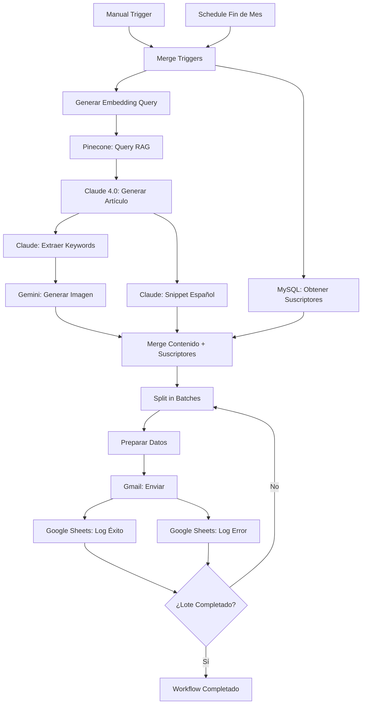

# 📨 Newsletter Mensual Automatizado con RAG


> Workflow completo de n8n para automatizar newsletters mensuales usando RAG (Retrieval-Augmented Generation), Claude 4.0, Gemini, y soporte bilingüe.

---

## 🎯 Descripción

Este proyecto proporciona un workflow de n8n completamente funcional que automatiza el proceso completo de creación y envío de un newsletter mensual:

1. **RAG Inteligente**: Consulta tu base de conocimiento en Pinecone para obtener los artículos más relevantes del mes
2. **Generación con IA**: Claude 4.0 Sonnet crea un artículo único y de alta calidad compilando los hallazgos
3. **Imágenes Profesionales**: Google Gemini genera automáticamente una imagen de cabecera personalizada
4. **Soporte Bilingüe**: Contenido principal en inglés + snippet en español para audiencia hispana
5. **Envío Masivo**: Distribución vía Gmail con batching inteligente para manejar miles de suscriptores
6. **Logging Completo**: Registro de envíos y errores en Google Sheets para análisis

---

## 📁 Archivos del Proyecto

```
n8n-workflows/
├── README.md                           # Este archivo
├── newsletter-mensual-automatizado.json # Workflow de n8n (IMPORTAR ESTO)
├── NEWSLETTER-SETUP.md                 # Guía completa de configuración
├── setup-database.sql                  # Script SQL para crear tablas MySQL
├── pinecone-data-example.json         # Ejemplos de estructura de datos Pinecone
├── pinecone-upload-example.py         # Script Python para poblar Pinecone
└── verify-credentials.py              # Script de verificación de credenciales
```

---

## 🚀 Quick Start (5 minutos)

### 1. Clonar este repositorio
```bash
git clone https://github.com/wichosaenz/n8n-workflows.git
cd n8n-workflows
```

### 2. Configurar credenciales

Crea un archivo `.env`:
```bash
# Pinecone
PINECONE_API_KEY=your-api-key
PINECONE_ENVIRONMENT=us-east-1-aws

# Anthropic Claude
ANTHROPIC_API_KEY=sk-ant-api03-xxxxx

# OpenAI (para embeddings)
OPENAI_API_KEY=sk-xxxxx

# Google Gemini
GEMINI_API_KEY=xxxxx

# MySQL
MYSQL_HOST=mysql.example.com
MYSQL_DATABASE=newsletter_db
MYSQL_USER=user
MYSQL_PASSWORD=password
```

### 3. Configurar base de datos
```bash
mysql -h mysql.example.com -u user -p newsletter_db < setup-database.sql
```

### 4. Poblar Pinecone con datos de prueba
```bash
pip install -r requirements.txt
python pinecone-upload-example.py
```

### 5. Verificar credenciales
```bash
python verify-credentials.py
```

Si todo está ✅, continúa al siguiente paso.

### 6. Importar workflow en n8n

1. Abre tu instancia de n8n
2. Ve a **Workflows** → **Import from File**
3. Selecciona `newsletter-mensual-automatizado.json`
4. Configura las 6 credenciales en n8n (ver [NEWSLETTER-SETUP.md](NEWSLETTER-SETUP.md))
5. Reemplaza `INSERTAR_SPREADSHEET_ID_AQUI` con tu Google Sheets ID

### 7. Ejecutar prueba

1. Click en **Execute Workflow**
2. Monitorea cada nodo
3. Verifica que recibes el email de prueba
4. Confirma que los logs aparecen en Google Sheets

---

## 📊 Arquitectura del Workflow



---

## 🔧 Tecnologías Utilizadas

| Servicio | Propósito | Alternativas |
|----------|-----------|--------------|
| **Pinecone** | Base vectorial para RAG | Weaviate, Qdrant, Chroma |
| **Anthropic Claude 4.0** | Generación de contenido | GPT-4o, Gemini Pro |
| **Google Gemini** | Generación de imágenes | DALL-E 3, Midjourney, Stable Diffusion |
| **OpenAI Embeddings** | Vectorización de texto | Voyage AI, Cohere, Anthropic |
| **MySQL** | Base de suscriptores | PostgreSQL, MongoDB |
| **Gmail** | Envío de emails | SendGrid, Mailgun, AWS SES |
| **Google Sheets** | Logging | Airtable, Notion, MySQL |

---

## 📚 Documentación Detallada

### 📖 [NEWSLETTER-SETUP.md](NEWSLETTER-SETUP.md)
Guía completa de configuración con:
- Instrucciones paso a paso para cada credencial
- Personalización del diseño HTML
- Troubleshooting de errores comunes
- Optimizaciones de rendimiento
- Mejores prácticas de seguridad

### 🗄️ [setup-database.sql](setup-database.sql)
Script SQL que incluye:
- Tabla de suscriptores con tokens de desuscripción
- Tabla de historial de newsletters
- Vistas para analytics
- Stored procedures útiles
- Datos de prueba

### 🔬 [pinecone-upload-example.py](pinecone-upload-example.py)
Script Python para:
- Crear y poblar índice de Pinecone
- Generar embeddings con OpenAI
- Ejemplos de 5 artículos de investigación
- Función para cargar desde CSV

### ✅ [verify-credentials.py](verify-credentials.py)
Verificación automática de:
- Conexiones a todas las APIs
- Existencia de tablas MySQL
- Disponibilidad de modelos de IA
- Configuración de Google Sheets

---

## 🎨 Características Destacadas

### 🧠 RAG Inteligente
- Consulta semántica usando embeddings
- Filtrado automático por fecha (mes anterior)
- Top-K configurable (50 artículos por defecto)
- Metadatos enriquecidos (autor, tema, fecha)

### ✍️ Generación de Contenido
- Claude 4.0 Sonnet para máxima calidad
- Prompts optimizados para newsletters académicos
- Estructura HTML profesional
- Síntesis de múltiples fuentes

### 🖼️ Imágenes Personalizadas
- Generación automática con Gemini
- Keywords extraídas del contenido
- Estilo corporativo y profesional
- Ratio 16:9 optimizado para emails

### 🌎 Soporte Bilingüe
- Artículo completo en inglés
- Snippet de invitación en español
- Fácil extensión a más idiomas
- Personalización por suscriptor

### 📧 Envío Escalable
- Batching de 100 emails (configurable)
- Manejo robusto de errores
- Reintentos automáticos
- Logging detallado

### 📈 Analytics y Monitoreo
- Registro de todos los envíos
- Tracking de errores
- Estadísticas en Google Sheets
- Vistas SQL para análisis

---

## 🔐 Seguridad y Compliance

- ✅ **GDPR Compliant**: Enlace de desuscripción obligatorio
- ✅ **CAN-SPAM Act**: Dirección física y opt-out incluidos
- ✅ **Tokens de desuscripción**: SHA-256 únicos por suscriptor
- ✅ **Rate limiting**: Batching para evitar bloqueos de API
- ✅ **Manejo de errores**: No expone información sensible
- ✅ **Variables de entorno**: Credenciales nunca en código

---

## 📊 Casos de Uso

Este workflow es ideal para:

- 📚 **Instituciones académicas** que publican investigación mensual
- 🏢 **Empresas B2B** con newsletters de thought leadership
- 🔬 **Think tanks** que compilan análisis de múltiples autores
- 📰 **Medios especializados** con contenido curado
- 💼 **Consultoras** que envían insights a clientes
- 🎓 **Universidades** con boletines de investigación

---

## 🛠️ Troubleshooting Común

### ❌ Error: "Pinecone index not found"
**Solución**: Ejecuta `pinecone-upload-example.py` para crear el índice.

### ❌ Error: "No matches found"
**Solución**: Verifica que tus vectores tengan `fecha_publicacion` del mes pasado.

### ❌ Error: "Gmail rate limit exceeded"
**Solución**: Reduce `batchSize` a 50 y añade un nodo `Wait` de 2 segundos.

### ❌ Emails van a spam
**Solución**: Configura SPF/DKIM en tu dominio o migra a SendGrid/Mailgun.

### ❌ Claude API timeout
**Solución**: Reduce `topK` de 50 a 20-30 en el nodo Pinecone.

Ver más en [NEWSLETTER-SETUP.md - Troubleshooting](NEWSLETTER-SETUP.md#-troubleshooting).

---

## 🚀 Roadmap

- [ ] **v1.1**: Personalización por suscriptor usando perfiles
- [ ] **v1.2**: A/B testing de asuntos y contenido
- [ ] **v1.3**: Analytics de apertura y clicks (tracking pixels)
- [ ] **v1.4**: Generación de versión PDF adjunta
- [ ] **v1.5**: Soporte multi-idioma completo (no solo snippet)
- [ ] **v1.6**: Preview mode con aprobación manual
- [ ] **v2.0**: Migración a SendGrid para >5000 suscriptores

---

## 🤝 Contribuciones

¡Las contribuciones son bienvenidas! Por favor:

1. Fork el repositorio
2. Crea una rama para tu feature (`git checkout -b feature/amazing-feature`)
3. Commit tus cambios (`git commit -m 'Add amazing feature'`)
4. Push a la rama (`git push origin feature/amazing-feature`)
5. Abre un Pull Request

---

## 📝 Licencia

Este proyecto está bajo licencia MIT. Ver [LICENSE](LICENSE) para más detalles.

---

## 👨‍💻 Autor

**Wicho Saenz**
GitHub: [@wichosaenz](https://github.com/wichosaenz)

---

## 🙏 Agradecimientos

- **n8n** por la plataforma de automatización open-source
- **Anthropic** por Claude 4.0 Sonnet
- **Pinecone** por la base vectorial de alto rendimiento
- **Google** por Gemini y suite de herramientas
- La comunidad de n8n por ejemplos y soporte

---

## 📞 Soporte

¿Necesitas ayuda?

- 📖 Revisa [NEWSLETTER-SETUP.md](NEWSLETTER-SETUP.md) para configuración detallada
- 🐛 Reporta bugs en [GitHub Issues](https://github.com/wichosaenz/n8n-workflows/issues)
- 💬 Únete a la [comunidad de n8n](https://community.n8n.io/)
- ✉️ Contacto directo: [crear issue]

---

<div align="center">

**⭐ Si este proyecto te fue útil, considera darle una estrella ⭐**

Made with ❤️ and AI by Wicho Saenz

</div>
